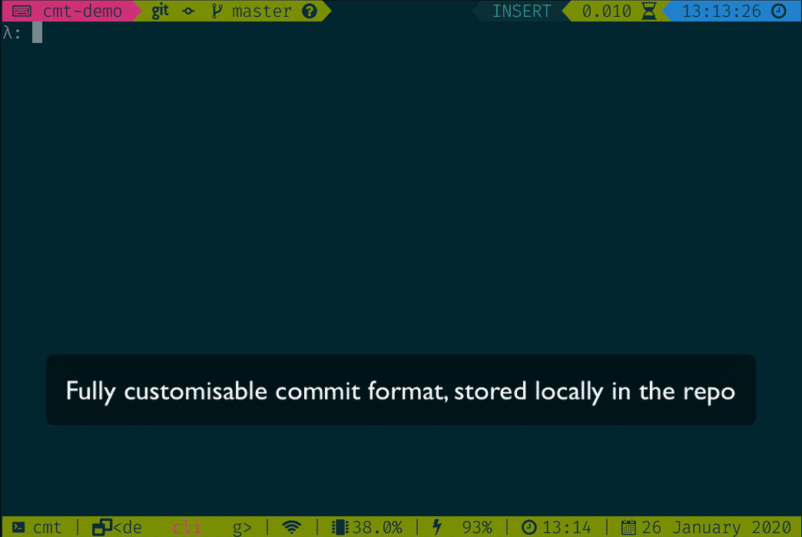

# cmt

Write consistent git commit messages based on a custom template.

Similar idea to [commitizen](https://github.com/commitizen/cz-cli), but with an emphasis on making it easy to define a custom commit style.

- [Concept](#Concept)
- [Format](#Format)
- [Usage](#Usage)
- [Install](#Install)




## Concept

It's important to write consistent commit messages, but depending on the project you may well want to use different commit styles.

With `cmt` you create a `.cmt` file in your project directory. The `.cmt` file enforces a particular style of commit message for that project. You can also add predefined commit messages for things like version bumps and updating the readme.

For example, for my programming projects I try to use a commit style similar to the [AngularJS Commit Message Guidelines](https://gist.github.com/stephenparish/9941e89d80e2bc58a153). However, this isn't appropriate for my teaching notes repos or for my capistrano build repos.


## Format

A `.cmt` file consist of two parts: the input parts and the output format.

A basic `.cmt` file to include a subject and body would look like:

```txt
# The input parts
{
    "Subject" = @ # Single line input
    "Body" = !@ # Multi-line input
}

# predefined commit messages
# this section is optional
{
    vb = "version bump"
}

# The output format
${Subject}

${Body}
```

A more complex example, the [AngularJS Commit Message Guidelines](https://gist.github.com/stephenparish/9941e89d80e2bc58a153):

```txt
# The input parts
{
    # Shows a list of options
    "Type" = [
        "feat",
        "fix",
        "docs",
        "style",
        "refactor",
        "test",
        "chore"
    ]
    "Scope" = @ # Single line input
    "Subject" = @
    "Body" = !@ # Multi-line input
    "Footer" = !@
}

# predefined messages
# this section is optional
{
    vb = "chore: version bump"
    readme = "docs: updated readme"
}

# The output format
# Takes the values provided from the input stage
# and interpolates them in
${Type} (${Scope}): ${Subject}

${Body}

${Footer}
```

For my capistrano build repos the `.cmt` file is simply:

```txt
{}

"latest build"
```


### Input Parts

These are at the top of the `.cmt` file and surrounded by opening and closing curly braces. A consist of a name and a type:

- `@`: single line input
- `!@`: multi line input
- `%`: select from a list of staged files
- `["option 1", "option 2"]`: list of options

### Predefined Messages

The predefined messages section is optional. You can provide a list of names and messages and then use the `-p <name>` command-line argument to use one of them.

For example, with the following config, `cmt -p vb` would use the message "version bump".

```txt
vb = "version bump"
```

Predefined messages can also use any input parts defined in the prior section. An example of this would be:

```txt
{
    "Project" = [
        "ghc",
        "cabal"
    ]
}
{
    vb = "${Project}: version bump"
}
```

Running `cmt -p vb` will now prompt you to select which project is getting version bumped.

### Output Format

The output format consists of named input parts (`${<name>}`) plus anything else you want.

#### Wildcard Output

You can accept an output called `${*}`, which will add in whatever is passed to `cmt` as command-line arguments.

For example:

```txt
# Input parts
# * input not needed, as comes from command-line
{
    "Scope" = %
}

# Scope from input and * from command-line
(${Scope}): ${*}
```

Then use with:

```bash
cmt "Blah blah blah"
```


## Usage

Add a `.cmt` file to your project directory.

```bash
cmt # will show the options and then commit
```

`cmt` will also look in your home directory if a `.cmt` file isn't found in the project directory hierarchy. This can be used to define a global commit style, which you can then override on a per-project basis.

### Predefined Messages

If there are commit message you use frequently (such as "version bump"), you can setup predefined messages with aliases:

```bash
cmt -p vb # use the version bump message
```

### Wildcard Output

If you're using the `${*}` format option then:

```bash
cmt "blah blah blah" # this will go in ${*} place
```

### Dry Runs

If you add `--dry-run` as the first argument, `cmt` will show you the output, but not try and make a commit. It will store the output so you can easily run it without having to re-enter everything.

```bash
cmt --dry-run "Blah blah blah"
cmt --dry-run -p vb
```

### Re-run Failed/Dry Run Commits

If the commit returns with a non-zero status code or you run with `--dry-run`, your previous commit message is stored in a `.cmt.bkp` file. You can re-run the commit when you're ready with:

```bash
cmt --prev
```

### Colour Output

By default the output uses bash colour codes. You can turn this off using the `--no-color` setting.


### Other Options

```bash
cmt -h # displays usage information
cmt -v # displays version number
cmt -c # displays location of .cmt file
```


## Install

### Homebrew (Mac)

You can install `cmt` on your Mac using [Homebrew](https://brew.sh):

```bash
brew install cmt
```

### Debian/Ubuntu

[A `.deb` package is available for Debian/Ubuntu](https://github.com/smallhadroncollider/cmt/releases). Download it and install with `dpkg -i <package-name>`.


### Binaries

[Binaries for Mac and Linux are available](https://github.com/smallhadroncollider/cmt/releases). Add the binary to a directory in your path (such as `/usr/local/bin`).

### Cabal

**Requirements**: [Cabal](https://www.haskell.org/cabal/)

```bash
cabal install cmt
```

Make sure you run `cabal update` first if you haven't run it recently.

### Building

**Requirements**: [Stack](https://docs.haskellstack.org/en/stable/README/)

The following command will build cmt and then install it in `~/.local/bin`:

```bash
stack build && stack install
```
